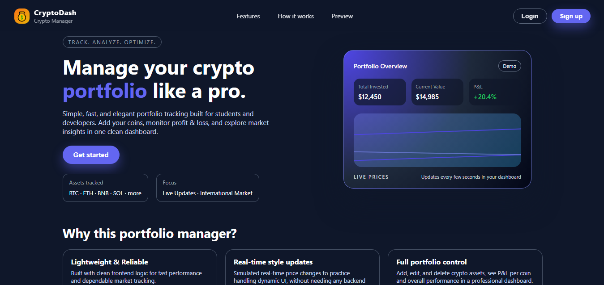

<!-- markdownlint-disable MD033 MD041 -->

# CryptoDash - Crypto Portfolio Dashboard

Lightweight cryptocurrency portfolio dashboard built with Java Spring Boot and Vanilla JavaScript

---

# 🛫 Project Badges

---

## 📖 About The Project

**CryptoDash** is a **modern crypto portfolio dashboard** built with a **Spring Boot backend** and a **lightweight Vanilla JavaScript frontend**. It allows users to track their cryptocurrency investments with **real-time profit/loss calculations**, clean analytics, and a responsive UI.

Designed for simplicity and performance, CryptoDash delivers **instant portfolio insights** without requiring complex setup or heavy dependencies.

> 💡 **Live Demo:** [CryptoDash Portfolio Dashboard](https://cryptodash-portfolio-dashboard.netlify.app/) *(Live Website)*

---

## ⭐ Repository Visitors

*Thank you for visiting! If you find this project useful, please consider giving it a ⭐*

---

## ✨ Features

| Feature | Description |
|--------|------------|
| 💰 **Portfolio Tracking** | Manage and monitor your crypto assets in one place |
| 📊 **Real-time P&L** | Instant profit/loss calculations based on your investments |
| 📈 **Performance Analytics** | Clear metrics for ROI, gains, and portfolio value |
| ➕ **Asset Management** | Add or remove cryptocurrencies بسهولة |
| ⚡ **Fast & Lightweight** | Vanilla JS frontend with ultra-fast updates (<50ms) |
| 📱 **Responsive UI** | Works seamlessly across mobile, tablet, and desktop |
| 🔗 **Full-Stack Integration** | Connected Spring Boot API with real-time data flow |
| 🧩 **Zero Dependencies** | No heavy frameworks required |

---

### 🎯 What You Get
- ✅ Real-time profit/loss tracking  
- ✅ Professional dashboard UI  
- ✅ Full-stack integration  
- ✅ No database setup required  
- ✅ Mobile-responsive design  
- ✅ Production deployed & tested  

  

---

# 🧠 System Architecture

Frontend (HTML/CSS/JS)  
↓  
Spring Boot API  
↓  
In-memory storage using arrays and objects  
↓  
Dashboard calculations (Profit/Loss & Total Investment)  

# ⚙️ Calculations & Logic

- Total investment = sum of all asset purchase values  
- Current portfolio value = sum of all asset current prices  
- Profit / Loss = Current Value − Total Investment  

All calculations happen **dynamically in JavaScript** and are updated in the dashboard UI.

## 🛣 Roadmap

- ✅ Add & manage crypto assets  
- ✅ Portfolio value calculation  
- ✅ Profit/Loss calculation  
- ⛔ Live crypto prices using API  
- ⛔ User authentication  
- ⛔ Database integration  

## 👨‍💻 Authors
- [**Saad Ali Rizvi**](https://www.linkedin.com/in/saad-ali-rizvi/)
- [**Syed Anas Hasan**](https://www.linkedin.com/in/anas19/)

---

## 🗒️ Note

This project is available for purchase and ready to be deployed or customized to your needs. A live demo is provided so you can explore its full functionality and performance before making a decision.

Looking for modifications or additional features? We also offer custom development and improvements tailored to your requirements.

💬 For pricing, full source code access, or negotiations:

- Email: digilinkstechsolutions@gmail.com

- Instagram: [**digilinks_tech_solutions**](https://www.instagram.com/digilinks_tech_solutions?igsh=OGs1ZGZiMHkxdHZz)

- Whatsapp: [**DigiLinks Contact**](https://wa.me/03157611879)

🌐 **Explore more projects:**

- GitHub: [**@digilinkstechsolutions**](https://github.com/digilinkstechsolutions)
  
- Website: [**Digilinks Professional Services**](https://digilinks-professional-services.netlify.app)

🚀 Serious inquiries only. Let’s build something impactful
